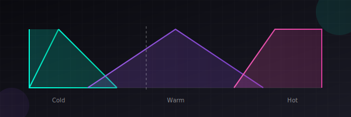

<div align="center">

# 🌫️ Fuzzy Engine

### A Modern Fuzzy Logic Library for JavaScript & TypeScript

[](https://www.npmjs.com/package/fuzzy-engine)
[](https://bundlephobia.com/package/fuzzy-engine)
[](https://www.typescriptlang.org/)
[](https://opensource.org/licenses/MIT)

**Elegant fuzzy logic inference for intelligent decision-making systems**

[Get Started](#-installation) · [Examples](#-examples) · [API Reference](#-api-reference) · [Demo](https://sureshreddy197.github.io/fuzzy-engine)

<br/>



</div>

---

## ✨ Features

<table>
<tr>
<td width="50%">

### 🎯 **Intuitive API**
Define fuzzy sets and rules using natural, readable syntax that mirrors how humans describe uncertain concepts.

### 🔥 **Blazing Fast**
Optimized inference engine processes thousands of evaluations per second with minimal memory footprint.

### 📦 **Zero Dependencies**
Lightweight core (~4KB gzipped) with no external dependencies. Works everywhere JavaScript runs.

</td>
<td width="50%">

### 🛡️ **Type Safe**
First-class TypeScript support with comprehensive type definitions and intelligent autocomplete.

### 🧩 **Extensible**
Create custom membership functions, defuzzification methods, and integrate with any framework.

### 🌐 **Universal**
Works in Node.js, browsers, Deno, Bun, and edge runtimes. ESM and CommonJS support.

</td>
</tr>
</table>

---

## 📦 Installation

```bash
# npm
npm install fuzzy-engine

# yarn
yarn add fuzzy-engine

# pnpm
pnpm add fuzzy-engine

# bun
bun add fuzzy-engine
```

**CDN Usage:**
```html
<script type="module">
  import { FuzzyEngine } from 'https://esm.sh/fuzzy-engine';
</script>
```

---

## 🚀 Quick Start

```typescript
import { FuzzyEngine, triangular, trapezoidal } from 'fuzzy-engine';

// Create a fuzzy inference system
const engine = new FuzzyEngine();

// Define input variable: Temperature
engine.addVariable('temperature', {
  cold: trapezoidal(0, 0, 10, 20),
  warm: triangular(15, 25, 35),
  hot: trapezoidal(30, 40, 50, 50)
});

// Define input variable: Humidity  
engine.addVariable('humidity', {
  dry: trapezoidal(0, 0, 30, 50),
  comfortable: triangular(40, 55, 70),
  humid: trapezoidal(60, 80, 100, 100)
});

// Define output variable: Fan Speed
engine.addOutput('fanSpeed', {
  low: triangular(0, 25, 50),
  medium: triangular(30, 50, 70),
  high: triangular(50, 75, 100)
});

// Add fuzzy rules
engine.addRules([
  { if: { temperature: 'cold', humidity: 'dry' }, then: { fanSpeed: 'low' } },
  { if: { temperature: 'warm', humidity: 'comfortable' }, then: { fanSpeed: 'medium' } },
  { if: { temperature: 'hot' }, then: { fanSpeed: 'high' } },
  { if: { humidity: 'humid' }, then: { fanSpeed: 'high' } }
]);

// Evaluate
const result = engine.evaluate({
  temperature: 28,
  humidity: 65
});

console.log(result.fanSpeed); // 67.3 (crisp output value)
```

---

## 📖 Examples

### 🌡️ Smart Thermostat

```typescript
import { FuzzyEngine, gaussian, sigmoid } from 'fuzzy-engine';

const thermostat = new FuzzyEngine();

// Room temperature perception
thermostat.addVariable('roomTemp', {
  freezing: sigmoid(-25, 5, 'left'),
  cold: gaussian(10, 5),
  comfortable: gaussian(22, 3),
  warm: gaussian(28, 4),
  hot: sigmoid(35, 5, 'right')
});

// Desired temperature difference
thermostat.addVariable('tempDiff', {
  tooLow: trapezoidal(-10, -10, -5, 0),
  optimal: triangular(-2, 0, 2),
  tooHigh: trapezoidal(0, 5, 10, 10)
});

// Heating/Cooling output
thermostat.addOutput('hvacPower', {
  coolHigh: triangular(-100, -75, -50),
  coolLow: triangular(-60, -30, 0),
  off: triangular(-10, 0, 10),
  heatLow: triangular(0, 30, 60),
  heatHigh: triangular(50, 75, 100)
});
```

### 🎮 Game AI Decision Making

```typescript
const enemyAI = new FuzzyEngine();

enemyAI.addVariable('health', {
  critical: trapezoidal(0, 0, 10, 30),
  wounded: triangular(20, 50, 80),
  healthy: trapezoidal(70, 90, 100, 100)
});

enemyAI.addVariable('ammo', {
  empty: trapezoidal(0, 0, 5, 15),
  low: triangular(10, 30, 50),
  full: trapezoidal(40, 70, 100, 100)
});

enemyAI.addVariable('enemyDistance', {
  close: trapezoidal(0, 0, 10, 30),
  medium: triangular(20, 50, 80),
  far: trapezoidal(70, 100, 200, 200)
});

enemyAI.addOutput('aggression', {
  flee: triangular(0, 15, 30),
  defensive: triangular(20, 40, 60),
  neutral: triangular(45, 55, 65),
  aggressive: triangular(55, 75, 90),
  berserk: triangular(80, 95, 100)
});
```

### 📊 Risk Assessment

```typescript
const riskEngine = new FuzzyEngine();

riskEngine.addVariable('marketVolatility', {
  stable: gaussian(10, 5),
  moderate: gaussian(30, 10),
  volatile: gaussian(60, 15)
});

riskEngine.addVariable('portfolioDiversity', {
  concentrated: trapezoidal(0, 0, 2, 5),
  moderate: triangular(3, 7, 12),
  diversified: trapezoidal(10, 15, 20, 20)
});

riskEngine.addOutput('riskLevel', {
  minimal: triangular(0, 10, 25),
  low: triangular(15, 30, 45),
  moderate: triangular(35, 50, 65),
  high: triangular(55, 70, 85),
  extreme: triangular(75, 90, 100)
});
```

---

## 📚 API Reference

### Membership Functions

| Function | Description | Parameters |
|----------|-------------|------------|
| `triangular(a, b, c)` | Triangle shape | left, peak, right |
| `trapezoidal(a, b, c, d)` | Trapezoid shape | left-foot, left-shoulder, right-shoulder, right-foot |
| `gaussian(center, sigma)` | Bell curve | center, standard deviation |
| `sigmoid(center, slope, direction)` | S-curve | inflection point, steepness, 'left' or 'right' |
| `bell(center, width, slope)` | Generalized bell | center, width, slope |
| `singleton(value)` | Single point | exact value |

### FuzzyEngine Methods

```typescript
class FuzzyEngine {
  // Variables
  addVariable(name: string, sets: Record<string, MembershipFunction>): void
  addOutput(name: string, sets: Record<string, MembershipFunction>): void
  
  // Rules
  addRule(rule: FuzzyRule): void
  addRules(rules: FuzzyRule[]): void
  
  // Evaluation
  evaluate(inputs: Record<string, number>): Record<string, number>
  evaluateVerbose(inputs: Record<string, number>): EvaluationResult
  
  // Configuration
  setDefuzzificationMethod(method: 'centroid' | 'bisector' | 'mom' | 'som' | 'lom'): void
  setAndMethod(method: 'min' | 'product'): void
  setOrMethod(method: 'max' | 'sum'): void
}
```

### Defuzzification Methods

| Method | Description |
|--------|-------------|
| `centroid` | Center of gravity (default) |
| `bisector` | Bisector of area |
| `mom` | Mean of maximum |
| `som` | Smallest of maximum |
| `lom` | Largest of maximum |

---

## 🔬 How It Works

Fuzzy Engine implements the **Mamdani fuzzy inference system**:

```
┌─────────────────────────────────────────────────────────────────┐
│                     FUZZY INFERENCE PROCESS                      │
├─────────────────────────────────────────────────────────────────┤
│                                                                  │
│  ┌──────────┐    ┌──────────┐    ┌──────────┐    ┌──────────┐  │
│  │  CRISP   │───▶│ FUZZIFY  │───▶│  APPLY   │───▶│AGGREGATE │  │
│  │  INPUT   │    │          │    │  RULES   │    │          │  │
│  └──────────┘    └──────────┘    └──────────┘    └──────────┘  │
│                                                        │         │
│                                                        ▼         │
│  ┌──────────┐                                  ┌──────────┐     │
│  │  CRISP   │◀─────────────────────────────────│DEFUZZIFY │     │
│  │  OUTPUT  │                                  │          │     │
│  └──────────┘                                  └──────────┘     │
│                                                                  │
└─────────────────────────────────────────────────────────────────┘
```

1. **Fuzzification**: Convert crisp inputs to fuzzy membership degrees
2. **Rule Evaluation**: Apply IF-THEN rules using fuzzy logic operators
3. **Aggregation**: Combine rule outputs into a single fuzzy set
4. **Defuzzification**: Convert fuzzy output to crisp value

---

## 🛠️ Advanced Usage

### Custom Membership Functions

```typescript
import { createMembershipFunction } from 'fuzzy-engine';

// Create a custom membership function
const customMF = createMembershipFunction((x, params) => {
  const { center, width } = params;
  const distance = Math.abs(x - center);
  return Math.max(0, 1 - (distance / width) ** 2);
});

engine.addVariable('input', {
  custom: customMF({ center: 50, width: 30 })
});
```

### Hedges (Linguistic Modifiers)

```typescript
import { very, somewhat, not, extremely } from 'fuzzy-engine/hedges';

engine.addVariable('temperature', {
  veryHot: very(trapezoidal(30, 40, 50, 50)),
  somewhatWarm: somewhat(triangular(15, 25, 35)),
  notCold: not(trapezoidal(0, 0, 10, 20))
});
```

### Weighted Rules

```typescript
engine.addRule({
  if: { temperature: 'hot', humidity: 'humid' },
  then: { fanSpeed: 'high' },
  weight: 0.8 // Rule strength (0-1)
});
```

---

## 🧪 Testing

```bash
# Run tests
npm test

# Run with coverage
npm run test:coverage

# Run benchmarks
npm run benchmark
```

---

## 📊 Benchmarks

| Operation | Ops/sec | Memory |
|-----------|---------|--------|
| Simple evaluation (3 rules) | 125,000 | ~2KB |
| Complex evaluation (50 rules) | 18,000 | ~8KB |
| Batch evaluation (1000 inputs) | 95,000 | ~12KB |

*Benchmarks run on Apple M1, Node.js 20*

---

## 🤝 Contributing

Contributions are welcome! Please read our [Contributing Guide](CONTRIBUTING.md) for details.

```bash
# Clone the repository
git clone https://github.com/sureshreddy197/fuzzy-engine.git

# Install dependencies
npm install

# Run development server
npm run dev

# Build
npm run build
```

---

## 📄 License

MIT © [Suresh Reddy](https://github.com/sureshreddy197)

---

<div align="center">

**[⬆ Back to Top](#-fuzzy-engine)**

Made with 💜 by [Suresh Reddy](https://github.com/sureshreddy197)

</div>
